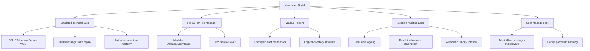
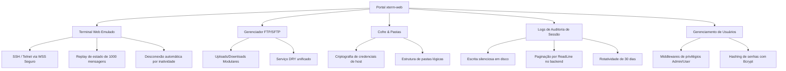

# XTerm Web

<p align="center">
  <a href="#-xterm-web---english">🇺🇸 English Version</a> &nbsp;|&nbsp;
  <a href="#-xterm-web---português">🇧🇷 Versão em Português</a>
</p>

---

## 🇺🇸 XTerm Web - English


A robust Web Terminal application based on Xterm.js and Node.js (ssh2). This application brings the "core" features of remote connection managers natively to your browser in a secure, responsive, and auditor-ready way.

### 🎯 What is it and What is it for?
* **Centralized Remote Access:** Access Linux servers, routers, switches, and FTP/SFTP files directly from any browser, eliminating the need for local desktop clients (like PuTTY or FileZilla).
* **Strict Session Auditing:** Record every keystroke and output on SSH/Telnet sessions in real-time to physical files on the server (retaining them for 30 days), facilitating LGPD/GDPR compliance and security forensics.
* **Operational Organization:** Manage, group, and structure connection credentials into hierarchical folders within a secure local Vault.

---

### 🌟 Core Features


* **Web-Based Emulated Terminal:** Integrated SSH and Telnet sessions using WebSockets. The frontend communicates with a secure Node.js backend using raw terminal output via `xterm.js`.
* **DRY File Transfer Panel (SFTP/FTP):** Access, download, edit, and upload files using a unified and reusable service layer. SFTP/FTP tabs can be launched side-by-side with your terminal.
* **Organized Folder Vault:** Create folder trees to structure servers. Securely encrypts host passwords in a local password vault.
* **Interactive & Paged Log Auditor:** View recording logs in real-time. Employs O(1) memory streams on the backend (paged every 500 lines) and an interactive frontend viewer with page controls, preventing browser lag.
* **Multi-Execution Mode (MultiExec):** Send commands simultaneously to multiple active terminal connections.
* **User & Role-Based Access Control (RBAC):** Restrict system administration, server audits, and global settings to Admin roles, using `bcrypt` (10 rounds) to hash local user passwords.
* **Collapsible UI & Macros:** Collapsible sidebar, customizable themes (Dark/Light), IDE-style tabs, shortcuts, and custom macro support.

---

### 🏗️ Architecture & Flow Diagram

The backend architecture is built under SOLID and DRY guidelines using a decoupled TypeScript directory tree:



---

### 🛡️ Technical & Business Advantages

#### A. SecOps & Hardening
* **Strict HTTPS/WSS:** Forces TLS/SSL cryptographic channels (`https://` and `wss://`) on external network interfaces.
* **JWT Signed Tokens:** Secure authentication tokens digitally signed with a configurable secret via environment variables, expiring in 8 hours.
* **HSTS & CSP Headers:** Enforced by Nginx reverse proxy, offering clickjacking protection (`X-Frame-Options: DENY`), mime sniffing defense (`nosniff`), and a strict Content Security Policy (CSP) against XSS.
* **Unprivileged Docker Runner:** The backend container runs under the unprivileged `node` user, mitigating container escape risks.

#### B. UX & Performance
* **ReadLine-based Streaming Logs:** The backend reads log files using a `readline` stream, ensuring O(1) memory complexity even on gigabyte-sized files.
* **Paged Log Viewer:** Users navigate through logs smoothly using i18n-supported controls (Previous, Next, and Page counter) in English, Portuguese, Spanish, and Mandarin.

#### C. DevOps & CI/CD Security
* **Automated CI/CD Pipeline:** Powered by GitHub Actions:
  1. Validates build pipelines (`npm run build`) for both backend and frontend under Node 20 on every push.
  2. Runs static security analysis (SAST) via **Trivy** (`aquasecurity/trivy-action`) to scan the filesystem for leaks, hardcoded credentials, and package vulnerabilities, blocking push stages on CRITICAL/HIGH errors.

---

### 🐳 Installation & Local Running

1. **Clone the repository:**
   ```bash
   git clone https://github.com/jonastduarte/xterm-web.git
   cd xterm-web
   ```
2. **Copy the environment file:**
   ```bash
   cp .env.example .env
   ```
3. **Start containers:**
   ```bash
   docker compose up -d --build
   ```
4. **Access the app:**
   * Frontend: `http://localhost`
   * Backend API: Mapped through reverse proxy.

5. **Initial Credentials:**
   * Username: `admin`
   * Password: `admin` *(Change immediately in the Users tab)*

---

### 📦 Production Deployment (Linux VPS)

If you wish to deploy XTerm Web to a VPS with Nginx, Docker, and an SSL certificate automatically issued via Let's Encrypt:

1. **Grant execution rights to the shell script:**
   ```bash
   chmod +x deploy.sh
   ```
2. **Execute deploy:**
   ```bash
   sudo ./deploy.sh
   ```

---

### ⚙️ Environment Variables

| Variable | Description | Default / Example |
| :--- | :--- | :--- |
| `PORT` | Listening port for the backend server | `3030` |
| `JWT_SECRET` | Cryptographic secret for signing JWT | *Strong random string* |
| `DATA_DIR` | Directory to persist SQLite database and audit logs | `/app/data` |
| `NODE_ENV` | Mode of execution for Node | `production` |

---

## 🇧🇷 XTerm Web - Português


Uma aplicação robusta de terminal web baseada em Xterm.js e Node.js (ssh2). Este projeto traz as principais funcionalidades de gerenciadores de conexões remotas nativamente para o seu navegador de forma segura, responsiva e pronta para auditoria técnica.

### 🎯 O que é e Para que serve?
* **Acesso Remoto Centralizado:** Acesse servidores Linux, roteadores, switches e sistemas de arquivos FTP/SFTP diretamente do navegador, eliminando clientes desktop locais (como PuTTY ou FileZilla).
* **Auditoria de Sessão Estrita:** Grava cada caractere transmitido em sessões SSH/Telnet em arquivos físicos em tempo real (mantidos por 30 dias), facilitando conformidade com a LGPD/GDPR e perícia técnica.
* **Organização Operacional:** Gerencie, agrupe e organize conexões em pastas lógicas dentro de um cofre criptografado (Vault).

---

### 🌟 Funcionalidades Principais


* **Terminal Web Emulado:** Sessões de SSH e Telnet via WebSockets. O frontend renderiza as conexões com o backend Node.js em tempo real utilizando `xterm.js`.
* **Gerenciador de Arquivos FTP/SFTP (DRY):** Navegue, baixe, edite e envie arquivos por meio de uma camada de serviços modular unificada. Abra sessões de arquivos lado a lado com seu terminal.
* **Cofre Criptografado de Pastas:** Estruture servidores em árvores de diretórios lógicos. As senhas de host são criptografadas localmente no cofre.
* **Auditor de Logs Paginado e Interativo:** Veja logs gravados no navegador de forma paginada a cada 500 linhas, consumidos de forma eficiente por streams de memória O(1) no backend, eliminando travamentos de renderização.
* **Modo de Multi-Execução (MultiExec):** Envie comandos simultâneos para múltiplos terminais de SSH conectados.
* **Controle de Acesso Baseado em Funções (RBAC):** Restrinja configurações e auditorias a administradores. As senhas locais do portal usam hashes seguros gerados com `bcrypt` (10 rounds).
* **Interface Customizável e Macros:** Barra lateral colapsável, temas personalizados (Escuro/Claro), abas estilo IDE, atalhos rápidos e suporte a macros personalizadas.

---

### 🏗️ Diagrama de Fluxo e Arquitetura

A arquitetura do backend segue os princípios SOLID e DRY com separação estrita de diretórios em TypeScript:



---

### 🛡️ Vantagens Técnicas e de Negócio

#### A. SecOps & Hardening
* **HTTPS/WSS Estrito:** Imposição de canais de comunicação criptografados (`https://` e `wss://`) para todas as conexões externas.
* **Tokens JWT Assinados:** Autenticação baseada em JSON Web Tokens com validade padrão de 8 horas e segredo configurável via variável de ambiente.
* **Cabeçalhos de Segurança HTTP (HSTS & CSP):** Forçados via proxy reverso do Nginx para bloquear clickjacking (`X-Frame-Options: DENY`), mitigar mime sniffing (`nosniff`) e impor Content Security Policy (CSP) contra XSS.
* **Usuário Docker Sem Privilégios:** O container do backend executa sob o usuário não-root `node`, limitando severamente os riscos de container escape.

#### B. UX & Performance
* **Streams por ReadLine:** O backend lê arquivos de log usando stream nativa e `readline`, assegurando complexidade O(1) de memória, mesmo em logs gigantescos de produção.
* **Visualização Paginada:** O frontend renderiza o log com paginação em tela suportada pelo i18n nos idiomas Inglês, Português, Espanhol e Chinês.

#### C. DevOps & Segurança de CI/CD
* **Pipeline de CI/CD Automatizado:** Construído no GitHub Actions:
  1. Executa validações de build (`npm run build`) para backend e frontend sob Node 20 a cada push de commits.
  2. Roda análises estáticas de segurança SAST via **Trivy** (`aquasecurity/trivy-action`) procurando credenciais vazadas e vulnerabilidades de pacotes, bloqueando o push se erros CRITICAL/HIGH forem detectados.

---

### 🐳 Instalação e Execução Local

1. **Clone o repositório:**
   ```bash
   git clone https://github.com/jonastduarte/xterm-web.git
   cd xterm-web
   ```
2. **Copie o arquivo de variáveis de ambiente:**
   ```bash
   cp .env.example .env
   ```
3. **Suba os containers:**
   ```bash
   docker compose up -d --build
   ```
4. **Acesse a aplicação:**
   * Frontend: `http://localhost`
   * API Backend: Mapeada pelo proxy reverso do Nginx.

5. **Credenciais Iniciais:**
   * Usuário: `admin`
   * Senha: `admin` *(Altere imediatamente no menu de Usuários)*

---

### 📦 Implantação em Produção (Linux VPS)

Caso deseje implantar o XTerm Web na nuvem com Nginx, Docker e emissão automática de certificado SSL via Let's Encrypt:

1. **Conceda permissão de execução ao script:**
   ```bash
   chmod +x deploy.sh
   ```
2. **Execute o deploy:**
   ```bash
   sudo ./deploy.sh
   ```

---

### ⚙️ Variáveis de Ambiente

| Variável | Descrição | Padrão / Exemplo |
| :--- | :--- | :--- |
| `PORT` | Porta de escuta do backend | `3030` |
| `JWT_SECRET` | Chave secreta de criptografia dos tokens JWT | *String randômica forte* |
| `DATA_DIR` | Pasta onde o SQLite e logs de auditoria serão gravados | `/app/data` |
| `NODE_ENV` | Modo de ambiente da execução Node | `production` |
