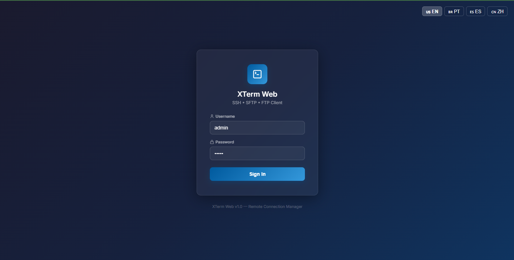
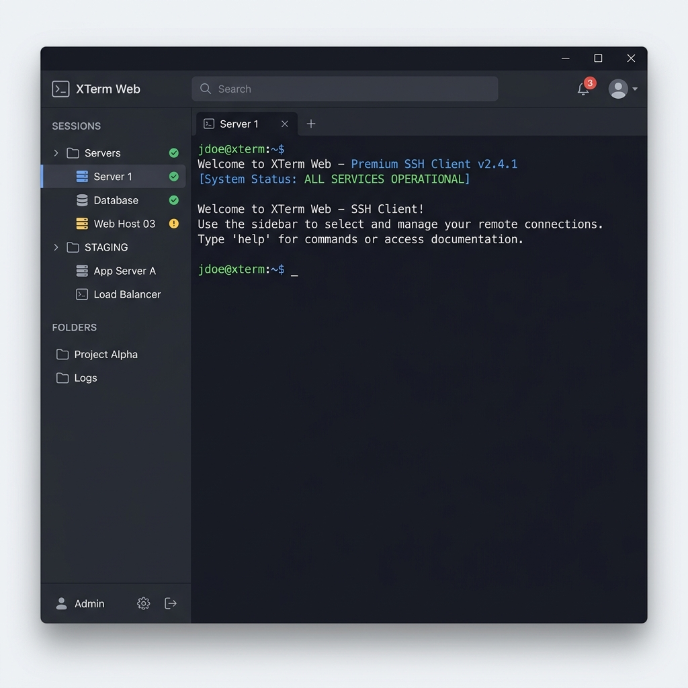
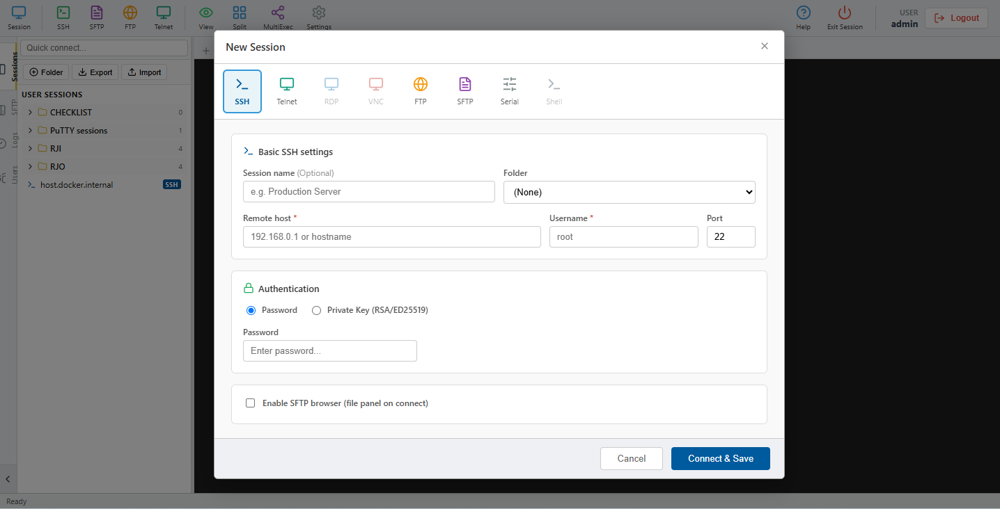

# XTerm Web



A robust Web Terminal application based on Xterm.js and Node.js (ssh2). This application brings the "core" features of remote connection managers natively to your browser, in a secure and responsive way.

## 🌟 Main Features



* **Full Web-based Terminal**: Integrated SSH, SFTP, and FTP connections using WebSockets. The frontend communicates with a Node.js backend that handles the actual connections.
* **Folder Organization**: Create hierarchical folder structures to organize and group hundreds of servers effortlessly.
* **Multi-language Support (i18n)**: Full support for English, Portuguese, Spanish, and Mandarin, applied across the entire application (UI and Alerts).
* **File Transfer Panel (SFTP)**: Access, download, edit, and upload files easily using drag-and-drop. Open an FTP/SFTP session alongside your SSH session or as a standalone file browser tab.
* **Password Vault**: Encrypt and store your connection passwords in a local vault using a Master Password for enhanced security. Passwords are never transmitted in plain text without protection.
* **Multi-Execution Mode (MultiExec)**: Send the same command simultaneously to multiple open terminals.
* **User & Log Management**: Internal user management interface, consolidated logs panel for all system activity, and role-based access control (Admin/User).
* **Dynamic & Customizable UI**: Dark/Light themes, font size controls, IDE-style tabs, a collapsible sidebar, quick shortcuts, and Macro support.



## 🚀 Technologies

- **Frontend:** React, TypeScript, Vite, Xterm.js, Lucide-React
- **Backend:** Node.js, Express, Ws (WebSockets), ssh2, basic-ftp, SQLite
- **Infrastructure:** Docker, Docker Compose, Nginx, GitHub Actions

## 🐳 Installation & Running Locally

The easiest and recommended way to run the application for development or testing is using Docker Compose:

1. **Clone the repository:**
   ```bash
   git clone https://github.com/jonastduarte/xterm-web.git
   cd xterm-web
   ```

2. **Copy the environment variables file:**
   ```bash
   cp .env.example .env
   ```

3. **Start the containers:**
   ```bash
   docker-compose up -d --build
   ```

4. **Access the application:**
   * Frontend (UI): `http://localhost`
   * The API and WebSocket connections are exposed on port `3000` (used internally by the proxy).

5. **Default login credentials:**
   * Username: `admin`
   * Password: `password` *(Change this in the Users settings)*

## 📦 Production Deployment (Linux VPS)

If you have an Ubuntu or Debian server and want to run XTerm Web in the cloud with an automatic SSL certificate:

1. Download the application to your VPS and grant execution permissions to the script:
   ```bash
   chmod +x deploy.sh
   ```
2. Run the automated installer:
   ```bash
   sudo ./deploy.sh
   ```

The script will set up Nginx and Docker, clone the repository, build it with `docker-compose`, and issue a valid SSL certificate via Certbot for your domain.

**Deployment Requirements:**
- A VPS (Ubuntu Server)
- A valid domain pointing to the VPS IP (A Records)
- Superuser (Sudo) privileges

## 🔄 CI/CD Automation

This project uses **GitHub Actions** and **GHCR** (GitHub Container Registry). 
Container builds and Docker image pushes occur automatically on every new commit to the `main` branch.

---
*Created with the goal of providing the best remote terminal experience via the browser.*
